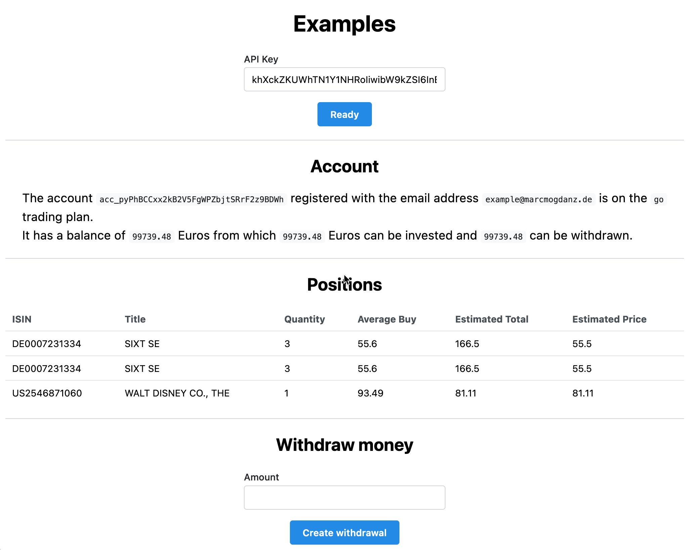

# Web example

A simple example app based on Next.js to showcase a few of the features of the API. All client-sided and in the browser.

## Local

- Clone the repository
- Install dependencies with yarn/npm
- Run `yarn dev` or `npm dev`
- Open [localhost:3000](http://localhost:3000)

## Online

Available via Vercel at [lemon-markets.vercel.app](https://lemon-markets.vercel.app/).
